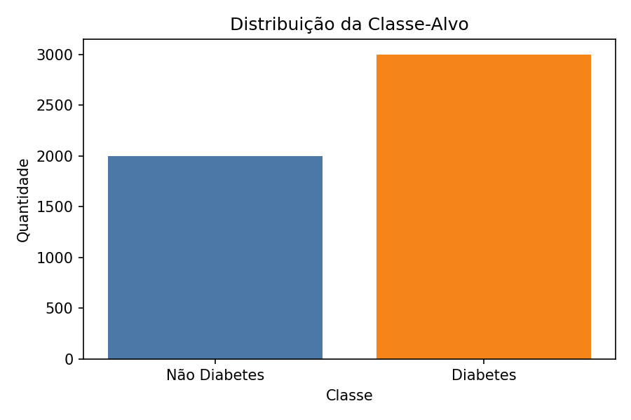
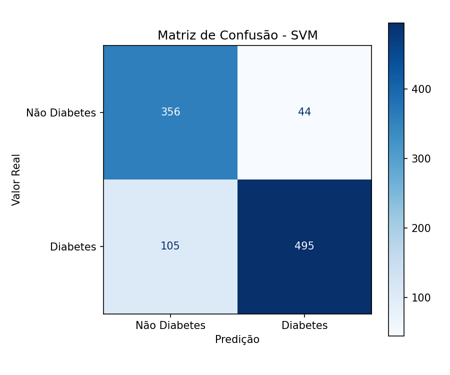
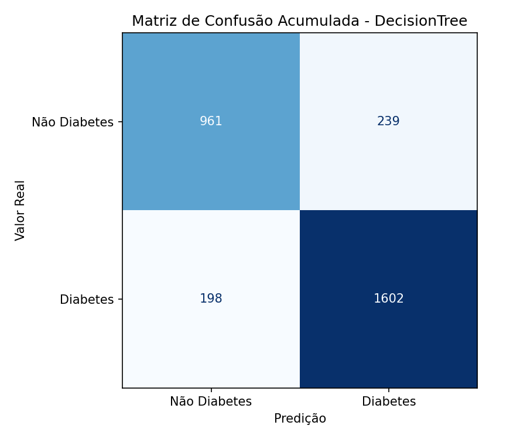
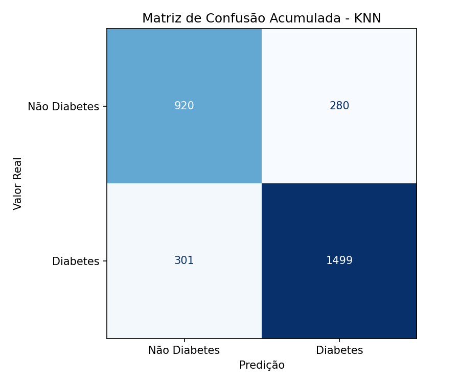

<p align="center"> 
  
</p>

<h1 align="center">
Diabetes Classification
</h1>

<h3 align="center">
Desenvolvimento de um experimento que contempla análise e compreensão dos dados, desde pré-processamento à definição de uma metodologia experimental adequada para a classificação de pacientes com Diabetes.
</h3>

<div align="center">


</div>

---

<div align="justify">
<p><strong>Disciplina:</strong> Inteligência Computacional<br>
<strong>Instituição:</strong> Centro Federal de Educação Tecnológica de Minas Gerais (CEFET-MG) - Campus V Divinópolis<br>
<strong>Professor:</strong> Alisson Marques da Silva<br>
<strong>Projeto:</strong> "Atividade Prática 01 - Metodologia Experimental"<br>
</div>


---


## Projeto e Base de Dados

Segundo José Antonio Miguel Marcondes (2003), o diabete afeta aproximadamente dez milhões de brasileiros e sua incidência vem aumentando, sobretudo no diabetes tipo 2. Nesse contexto, a classificação de pacientes é relevante para apoiar ações de prevenção e acompanhamento.

Este trabalho, desenvolvido na disciplina de Inteligência Computacional, utiliza a base pública **Diabetes Health Indicators Dataset** (Kaggle), com `100.000` registros e `31` atributos, para um problema de **classificação binária** cujo alvo é `diagnosed_diabetes` (`0` ou `1`). A base reúne variáveis sociodemográficas, hábitos de vida, histórico clínico e biomarcadores, o que a torna adequada ao enunciado por conter atributos heterogêneos e permitir uma metodologia experimental realista.

Com base nas dificuldades que serão apresentadas posteriormente, necessitou-se da aplicação de etapas de pré-processamento, dentre elas a codificação de atributos categóricos (através do `OneHotEncoder` da biblioteca `sklearn`), a separação estratificada entre treino e teste, a padronização de atributos numéricos para modelos sensíveis à escala (`KNN` e `SVM`) e a seleção embarcada de atributos com `SelectFromModel` + `RandomForestClassifier`. Em conjunto, essas etapas reduziram ruído, preservaram representatividade da classe-alvo e melhoraram a comparabilidade entre os classificadores.

## Metodologia Adotada e Consolidação no Código

As implementações principais estão em `Diabetes-Classification/src/preprocessing.py`, `Diabetes-Classification/src/models.py` e `Diabetes-Classification/src/main.py`. O fluxo foi simplificado para priorizar o que o enunciado e a orientação docente cobram com maior ênfase: processamento dos dados e modelagem, mantendo avaliação objetiva e reprodutível. No pré-processamento, foi mantida a amostragem estratificada (quando aplicável), garantindo representatividade da classe-alvo ao reduzir a base:

```python
if n_samples < len(df):
    df, _ = train_test_split(
        df,
        train_size=n_samples,
        stratify=df["diagnosed_diabetes"],
        random_state=42,
    )
```

Para atender ao enunciado sem inflar a quantidade de artefatos, foi implementada uma EDA mínima com um resumo tabular da base e um gráfico de distribuição da classe-alvo. Essa visão inicial já caracteriza a base e o balanceamento do alvo, servindo de suporte para as decisões de modelagem apresentadas a seguir:

```python
resumo_exploratorio = pd.DataFrame(
    [{
        "total_registros": int(len(df)),
        "total_atributos": int(df.shape[1]),
        "atributos_numericos": int(df.select_dtypes(include=[np.number]).shape[1]),
        "atributos_categoricos": int(df.select_dtypes(exclude=[np.number]).shape[1]),
        "classe_positiva_pct": float((df["diagnosed_diabetes"] == 1).mean() * 100),
    }]
)
```

No `main.py`, a função `_run_data_quality_assessment` consolida a integridade da base em um único resumo com total de ausentes, total de duplicados, proporção da classe positiva e maior percentual de outliers por IQR. A avaliação de qualidade continua formal, mas enxuta, reduzindo excesso de artefatos e mantendo rastreabilidade para decisões de processamento. Quando aplicável, as decisões de tratamento são tomadas a partir desses indicadores; nesta base/amostra atual, os resultados indicaram ausência de valores faltantes e duplicatas, não exigindo imputação ou deduplicação adicional nesta etapa.

```python
    quality_summary = {
        "total_ausentes": float(missing_total),
        "total_duplicados": float(duplicate_count),
        "proporcao_classe_positiva_pct": float(positive_class_ratio),
        "atributo_maior_outlier": feature_with_max_outlier,
        "maior_outlier_pct_iqr": float(max_outlier_pct),
    }
```

A função `_evaluate_models` treina `KNN`, `SVM` e `DecisionTree` sob o mesmo protocolo, calcula `accuracy`, `precision`, `recall`, `f1-score`, componentes da matriz de confusão e adiciona validação cruzada estratificada para robustez. Para justiça experimental, cada modelo é avaliado em **3 repetições** com sementes distintas e as métricas finais são reportadas por **média**, reduzindo viés de uma única partição treino/teste.

```python
    repeat_seed = 42 + repeat_index
    cv = StratifiedKFold(n_splits=5, shuffle=True, random_state=repeat_seed)
    cv_scores = cross_val_score(
        pipeline,
        X_train,
        y_train,
        cv=cv,
        scoring="f1",
    )
```

```python
    rows.append(
        {
            "modelo": model_name,
            "f1_cv_media": float(np.mean(stats["f1_cv_media"])),
            "f1_cv_desvio": float(np.mean(stats["f1_cv_desvio"])),
            "accuracy": float(np.mean(stats["accuracy"])),
            "precision": float(np.mean(stats["precision"])),
            "recall": float(np.mean(stats["recall"])),
            "f1_score": float(np.mean(stats["f1_score"])),
            "verdadeiro_negativo": int(cm_sum[0, 0]),
            "falso_positivo": int(cm_sum[0, 1]),
            "falso_negativo": int(cm_sum[1, 0]),
            "verdadeiro_positivo": int(cm_sum[1, 1]),
        }
)
```

Para manter o foco pedagógico em modelagem, a discussão final é feita a partir das tabelas e matrizes de confusão geradas, com comparação dos `f1_cv_media` e `f1_score`, análise de falsos positivos/falsos negativos e leitura dos `top3_atributos` por modelo. Isso mantém a entrega enxuta e suficiente para discutir decisões metodológicas sem excesso de visualizações.

### Detalhamento da justiça experimental

Para reduzir viés de avaliação, todos os modelos são submetidos ao mesmo protocolo: mesma base amostrada, mesma estratégia de divisão estratificada e mesma rotina de validação cruzada. Além disso, são feitas `3` repetições com sementes diferentes (`42`, `43`, `44`), e as métricas finais são reportadas por média. Dessa forma, evita-se que a comparação entre algoritmos dependa de uma única partição favorável/desfavorável.


## Resultados

Os resultados abaixo referem-se à execução com `n_samples=5000` e `n_repeats=3`, seguindo o protocolo implementado no `main.py`.

- Total de registros analisados: `5000`
- Valores ausentes: `0`
- Registros duplicados: `0`
- Proporção da classe positiva (`diagnosed_diabetes = 1`): `60.0%`
- Atributo com maior percentual de outliers (IQR): `hypertension_history` (`24.94%`)

### Comparação quantitativa dos modelos

| Modelo | F1 (CV média) | F1 (teste) | Accuracy | Precision | Recall |
|---|---:|---:|---:|---:|---:|
| SVM | 0.8816 | **0.8858** | **0.8680** | **0.9198** | 0.8544 |
| DecisionTree | **0.8863** | 0.8800 | 0.8543 | 0.8702 | **0.8900** |
| KNN | 0.8313 | 0.8376 | 0.8063 | 0.8426 | 0.8328 |

Top-3 atributos mais relevantes (comum aos modelos nesta execução): `hba1c`, `glucose_postprandial`, `glucose_fasting`.

### Visualizações

<p align="center">
    
</p>

<p align="center">
    
    
    
</p>


### Discussão e Conclusão

1. `SVM` apresentou o melhor equilíbrio nas métricas médias de teste, com maior `F1-score` e maior `accuracy` após 3 repetições.
2. `DecisionTree` teve melhor média de `F1` na validação cruzada e maior `recall`, indicando maior sensibilidade para detectar casos positivos.
3. `KNN` ficou abaixo dos demais nas métricas médias para este cenário.
4. A consistência dos atributos `hba1c`, `glucose_postprandial` e `glucose_fasting` reforça sua relevância clínica na predição.
5. Como encaminhamento metodológico, a escolha final do modelo deve considerar o trade-off entre `precision` e `recall` conforme o objetivo prático (minimizar falsos positivos ou falsos negativos).


## Como Executar

Use o script `run_project.sh`, que instala as dependências automaticamente via `requirements.txt` e executa o projeto.

Execução padrão:

```bash
./run_project.sh
```

Execução com parâmetros (opcional):

```bash
./run_project.sh --n-samples 5000 --n-repeats 3
```

Obs.: se necessário, garanta permissão de execução do script:

```bash
chmod +x run_project.sh
```

Ao final da execução, são gerados artefatos em `Diabetes-Classification/outputs/`:

- `tables/resumo_exploratorio.csv`
- `tables/resumo_qualidade_dados.csv`
- `tables/comparacao_modelos.csv`
- `plots/distribuicao_classe_alvo.png`
- `plots/cm_KNN.png`, `plots/cm_SVM.png`, `plots/cm_DecisionTree.png`


## Referências

MARCONDES, José Antonio Miguel. Diabete melito: fisiopatologia e tratamento. Revista da Faculdade de Ciências Médicas de Sorocaba, [S. l.], v. 5, n. 1, p. 18–26, 2007. Disponível em: https://revistas.pucsp.br/index.php/RFCMS/article/view/117. Acesso em: 24 mar. 2026.

Rakesh Kolipaka, and Ranjith Kumar Digutla. (2025). Diabetes Health Indicators Dataset [Data set]. Kaggle. https://doi.org/10.34740/KAGGLE/DSV/13128284


